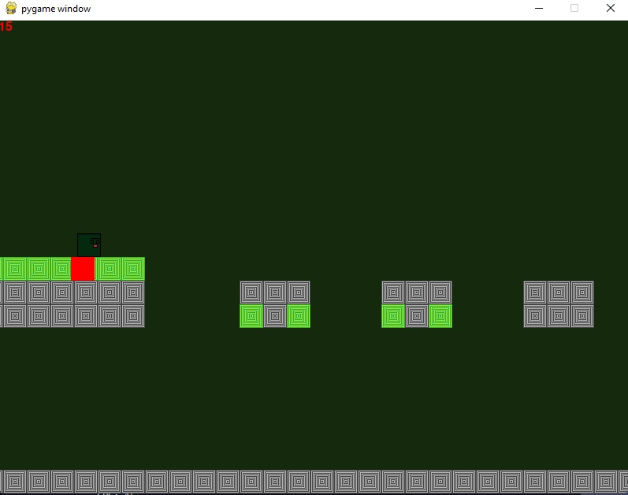
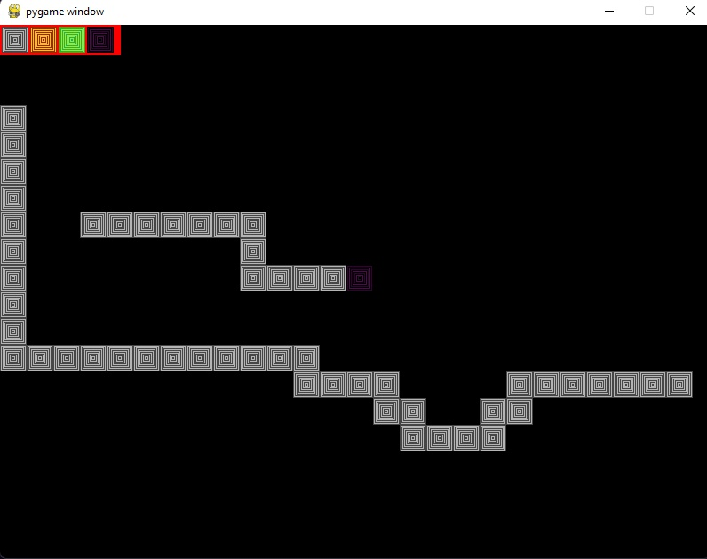

# Simple Game

using pygame and numpy arrays.

## Requirements

* numpy
* pygame
* json
* lib

## install
 ``` bash
 pip install numpy pygame json lib
 ```
## photos
Gameplay


Creating new map

## Classes:

1. Player: This class defines the player object with its attributes like position, size, movement speed, jump mechanics, and a collision detection variable.
2. Game: This class manages the overall game logic. It includes functionalities for:
Map creation and manipulation
Loading and saving maps from JSON files
Drawing the game screen (background, player, and blocks)
Handling player movement and collisions
Game loop

## Functions:

* editing_loop: This function handles the level editing mode, allowing users to create and modify maps using the mouse and keyboard.
* return_maps: This function reads the saved maps (in JSON format) and displays their information.
map_taker: This function loads a specific map based on its name provided by the user.
* find_start: This function finds the starting position (player spawn point) within the loaded map.
collision_down and collision_right: These functions check for collisions between the player and the blocks below and to the right, respectively.
* draw_map: This function draws the map on the screen with the corresponding block images.
* draw: This function combines drawing the map and the player sprite.
* render_Text: This function renders text on the screen for displaying FPS.
* loop: This function is the main game loop that continuously updates the game state (player movement, collisions, rendering) and handles user input.

## Overall Structure:

The code is well-organized with clear class definitions and functions. The editing_manager function acts as the entry point, allowing users to choose between editing an existing level or creating a new one.

### Potential improvements:

1. Error handling: The code could benefit from error handling mechanisms, for example, handling situations where a map file is not found or corrupted.
2. More player controls: Adding functionalities like left/right movement and jumping control with the keyboard would enhance gameplay.
3. Game mechanics: Implementing additional game mechanics like enemies, power-ups, and goals could make the game more engaging.
4. Menu system: Creating a menu for level selection and other options could improve user experience.
5. Optimization: Optimizing the collision detection and rendering logic could improve game performance for larger maps.

